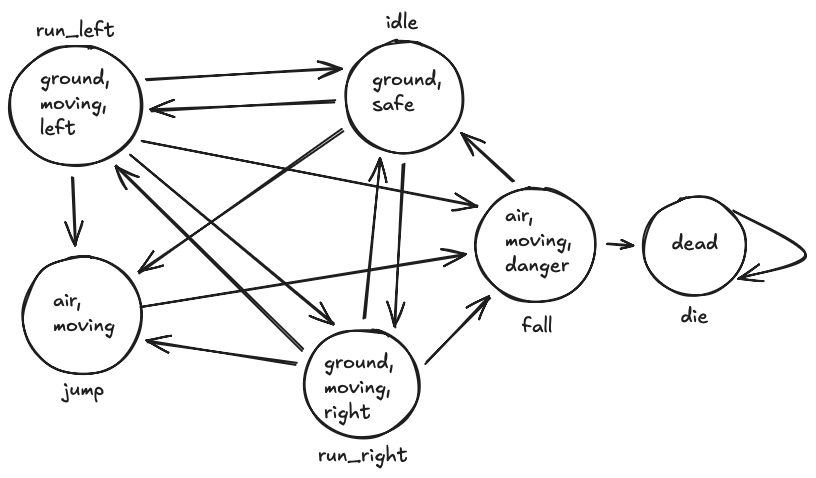

# **DD1351 – Lab3: Model checker in prolog**

#### Authors:

-   Emilia Lindqvist
-   Adam Viberg

#### Date: HT25 09/12

## **1. Objective**

The goal of this lab is to implement a model checker for **CTL** (Computational Tree Logic) in Prolog.
Each input file contains:

1. A **transition system** T (adjacency lists)
2. A **labeling function** L
3. A **start state** S
4. A CTL **formula** F

The program outputs:

-   **yes** if M, S ⊨ F
-   **no** otherwise

The checker follows the derivation rules from the CTL proof system.

## **2. Algorithm description**

### Overview

**The CTL model checker revolves around four main components:**

| Predicate      | Function                                                 |
| -------------- | -------------------------------------------------------- |
| `verify/1`     | Reads T, L, S, and F from a file and calls `check/5`.    |
| `check/5`      | The core recursive predicate implementing CTL rules.     |
| `successors/3` | Retrieves all successor states of a given state.         |
| `labeled/3`    | Retrieves atomic propositions true in the current state. |

### CTL judgement form

The checker verifies sequents of the form:

```
(T, L), S ⊢_U F
```

Where:

-   **S** — current state
-   **F** — CTL formula
-   **U** — visited states (loop detection for AG/EG/AF/EF)
-   **T** — transitions
-   **L** — labeling
-   The list **U** prevents infinite recursion and ensures correct semantic treatment of loops.

### Predicate truth conditions

| Predicate                             | True when                                                                                                                                                | False when                                                                      |
| ------------------------------------- | -------------------------------------------------------------------------------------------------------------------------------------------------------- | ------------------------------------------------------------------------------- |
| **verify(File)**                      | The model, state and formula read from `File` satisfy `check(T,L,S,[],F)`. Prints `yes`.                                                                 | `check(T,L,S,[],F)` fails. Prints `no`.                                         |
| **check(T, L, S, U, F)**              | The CTL formula `F` is true in state `S` of model `(T,L)` under loop-history `U`, according to CTL proof rules (atom, neg, and/or, AX/EX, AG/EG, AF/EF). | None of the clauses for `check/5` match or succeed; recursive evaluation fails. |
| **successors(T, S, Succ)**            | The adjacency list `T` contains an entry `[S, Succ]`.                                                                                                    | No such entry exists _leads to_ `S` has no defined successors.                  |
| **labeled(L, S, Atoms)**              | The labeling list `L` contains `[S, Atoms]`.                                                                                                             | No labeling entry exists _leads to_ `S` has no defined atomic propositions.     |
| **check_all(T, L, [S1,…,Sn], U, F)**  | `check(T,L,Si,U,F)` succeeds for _all_ successors in the list.                                                                                           | At least one `Si` makes `check/5` fail.                                         |
| **check_some(T, L, [S1,…,Sn], U, F)** | `check(T,L,Si,U,F)` succeeds for _at least one_ successor.                                                                                               | All evaluations fail for every `Si`.                                            |

## **3. CTL Loop Handling (U-list)**

The U-list is crucial for correctly evaluating **temporal modalities involving paths**, especially G (“globally”) and F (“eventually”) operators.

#### G-formulas (AG, EG)

Loop = **success**
Because reaching the same state with the same G-formula means the property holds on all infinite extensions.

#### F-formulas (AF, EF)

Loop = **failure**
Because looping without ever reaching the target formula F implies it may never be reached.

Thus:
| **Operator** | **Loop (S ∈ U)** |
| -------- | ------------ |
| **AG** | success |
| **EG** | success |
| **AF** | failure |
| **EF** | failure |

The U-list is conceptually identical to the **Verified** list in Lab 2:
it stores historical context required for the proof to be sound and terminating.

## **4. Modellering**

The model `M` represents the behavior of a platform game such as Super Mario. The states `S` describe the possible actions in the game, such as running, jumping, standing still, etc. The labeling function `L` indicates which variables hold true in each state. For example, it illustrates that the character is safe when standing still, in danger when falling, in the air when jumping or falling, and on the ground when running or idling.

M = (S, ->, L)
S = {idle, run_left, run_right, jump, fall, die}
-> =

```prolog
[
  [idle,      [run_left, run_right, jump]],
  [run_left,  [idle, run_right, jump, fall]],
  [run_right, [idle, run_left, jump, fall]],
  [jump,      [fall]],
  [fall,      [idle, die]],
  [die,       [die]]
].
```

L =

```prolog
[
  [idle,      [ground, safe]],
  [run_left,  [ground, moving, left]],
  [run_right, [ground, moving, right]],
  [jump,      [air, moving]],
  [fall,      [air, moving, danger]],
  [die,       [dead]]
].
```

Graph:


## **5. Specifiering**

### **ag(ef(safe)).**

This system property does not hold. This is because it implies that it is always possible to return to a safe state (i.e., return to idle) regardless of previous actions. However, this is not possible due to the die state which cannot be exited once entered.

### **ag(or(neg(left), ef(right))).**

This system property does hold. This is because it implies that if you run left, you have to be able to reach run right. In our model we have the transition from run_left to run_right and therfore it always holds.

## **6. Discussion**

The final model checker correctly implements CTL semantics and passes the provided tests.
However, during development we encountered some challenges.

### **Challenges during development:**

#### **Loop detection logic**

Initially, AG and AF would loop infinitely.
The correct usage of U-lists (as in the proof system) solved this.

#### **Handling “all successors” vs “some successor”**

The distinction required implementing:

-   `check_all/5`
-   `check_some/5`

similar to Labb 2s structured recursion over boxes.

#### **Structuring recursion by formula type**

Just like Lab 2 used `valid_line/3`, Lab 3 required:

-   one `check/5` clause per CTL operator
-   exact pattern matching on CTL constructors

After fixing these, the verifier successfully passed all test cases and custom examples.

## **7. Conclusion**

The CTL model checker:

-   Fully implements the proof system for the CTL fragment in the lab specification

-   Correctly evaluates temporal logic formulas on finite transition systems

-   Handles loops using a U-list analogous to the Verified context in Lab 2

-   Passes the complete test suite of valid and invalid examples

## **Appendix**

### Appendix A: Program code:

`Check.pl`:

```prolog
verify(Input) :-
    see(Input), read(T), read(L), read(S), read(F), seen,
    ( check(T, L, S, [], F)
    -> format('yes~n', [])
    ;  format('no~n', [])
    ).

successors(T, S, Succ) :- member([S, Succ], T).
labeled(L, S, Atoms) :- member([S, Atoms], L).

check_all(_, _, [], _, _).
check_all(T, L, [S|Rest], U, F) :-
    check(T, L, S, U, F),
    check_all(T, L, Rest, U, F).

check_some(T, L, [S|_], U, F) :-
    check(T, L, S, U, F).
check_some(T, L, [_|Rest], U, F) :-
    check_some(T, L, Rest, U, F).

check(_, L, S, [], P) :-
    atom(P),
    labeled(L, S, A),
    member(P, A), !.

check(_, L, S, [], neg(P)) :-
    atom(P),
    labeled(L, S, A),
    \+ member(P, A), !.

check(T, L, S, U, and(F, G)) :-
    check(T, L, S, U, F),
    check(T, L, S, U, G).

check(T, L, S, U, or(F, _)) :- check(T, L, S, U, F), !.
check(T, L, S, U, or(_, G)) :- check(T, L, S, U, G).

check(T, L, S, [], ax(F)) :-
    successors(T, S, Succ),
    check_all(T, L, Succ, [], F).

check(T, L, S, [], ex(F)) :-
    successors(T, S, Succ),
    check_some(T, L, Succ, [], F).

check(_, _, S, U, ag(_)) :- member(S, U), !.
check(T, L, S, U, ag(F)) :-
    \+ member(S, U),
    check(T, L, S, [], F),
    successors(T, S, Succ),
    check_all(T, L, Succ, [S|U], ag(F)).

check(_, _, S, U, eg(_)) :- member(S, U), !.
check(T, L, S, U, eg(F)) :-
    \+ member(S, U),
    check(T, L, S, [], F),
    successors(T, S, Succ),
    check_some(T, L, Succ, [S|U], eg(F)).

check(T, L, S, U, af(F)) :-
    \+ member(S, U),
    check(T, L, S, [], F), !.
check(T, L, S, U, af(F)) :-
    \+ member(S, U),
    successors(T, S, Succ),
    check_all(T, L, Succ, [S|U], af(F)).

check(T, L, S, U, ef(F)) :-
    \+ member(S, U),
    check(T, L, S, [], F), !.
check(T, L, S, U, ef(F)) :-
    \+ member(S, U),
    successors(T, S, Succ),
    check_some(T, L, Succ, [S|U], ef(F)).
```
